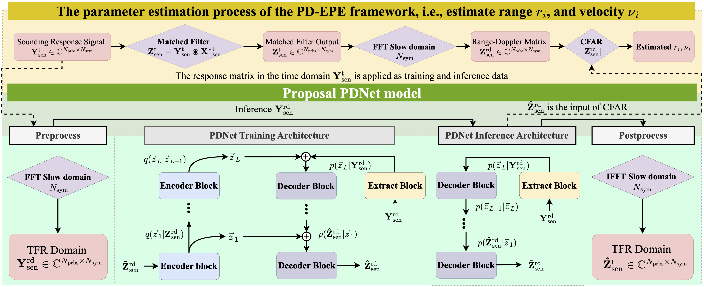
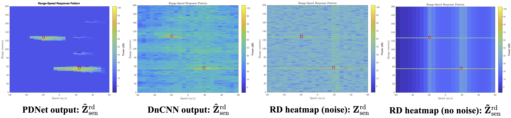

# Probabilistic Denoising-Enhanced Parameter Estimation for Multi-Target Detection

> Nghia Thinh Nguyen and Tri Nhu Do, “Probabilistic Denoising-Enhanced Parameter Estimation for Multi-Target Detection,” *Submitted to the 39th IEEE Canadian Conference on Electrical and Computer Engineering (CCECE 2026), Montreal, Quebec, Canada*.

## Abstract

Accurate parameter estimation is critical for multi-target detection; however, conventional signal processing approaches face fundamental limitations in practical environments, including limited prior knowledge, cluttered multi-target scenarios, and time-varying propagation conditions. This paper proposes a probabilistic machine learning framework for radar parameter estimation utilizing phase-modulated continuous-wave signals. Our approach, called Probabilistic Denoising-Enhanced Parameter Estimation (PD-EPE), replaces matched filtering with an end-to-end learned denoising pipeline that enhances estimation accuracy. A novel lightweight probabilistic denoising neural network (PDNet) is introduced to generate high-quality range-Doppler representations by improving target discriminability in realistic simulations. Through complexity analysis, we demonstrate that our proposed method offers significantly improved computational efficiency, making it suitable for real-time applications. PD-EPE achieves superior parameter estimation performance with lower mean squared error and improved detection compared to the state-of-the-art baseline.

## Setup

This codebase is implemented in Python and Matlab and has been tested on macOS devices.

* The Matlab code is used to simulate the data and evaluate the parameter estimation.
* The Python code is used to train and test the proposed model as a preprocessing step for parameter estimation.

The system pipeline is described in the figure below.



### Simulation Data

The simulation code is located at

```
mat/simulation.m
```

The simulated data are saved at `source_dir = "path/to/data"`. The data include response sequences with noise and response sequences without noise.

### Training/Testing PDNet

After simulating the data, we need to change the configuration settings in the `ml/configs` folder. Change `root_dir='path/to/data/mats/freq/'`. Then set up the environment in `ml/config/ml.py`. After that, run:

```
cd ml
export PYTHONPATH=`pwd`
pip install -r requirements.txt
```

We compare the proposed method with another ML-based model (DnCNN). Depending on the settings in `ml/config/ml.py`, we can run the training and testing processes as follows:

```
# Training DnCNN model
python scripts/train/train_dncnn_y.py

# Training PDNet model
python scripts/train/train_pdnet_y.py

# Test DnCNN/PDNet model
python scripts/test/test_y.py
```

After testing, we can run:

```
# Visualize the distribution of the denoising process
python scripts/vis_dis.py

# Visualize the RD heatmap of the data
python scripts/vis_rd.py
```

### Evaluation Parameter Estimation



We set up `mat/rvest/` to estimate the range and velocity of the targets. Then run:

```
# Comparison of the CRLB of the proposed method
vis_crlb_time.m 

# Comparison of the NMSE of the proposed method
vis_nmse_time.m 
```
